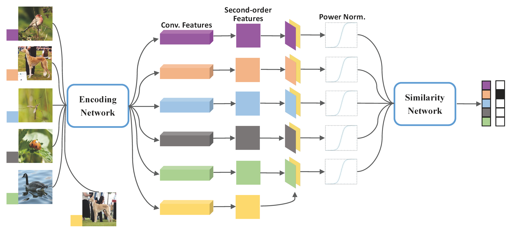

# SoSN-wacv19-master

Pytorch Implementation of IEEE WACV2019 "[Power Normalizing Second-order Similarity Network for Few-shot Learning](https://arxiv.org/pdf/1811.04167.pdf)".
This is based on the code of Relation Net.

Download formatted miniImagenet:<br/>
https://drive.google.com/file/d/1QhUs2uwEbVqCVig6B6cQmI0WTdYy2C9t/view?usp=sharing<br/>

Download pre-processed OpenMIC dataset with following links:<br/>
[Protocol I] https://drive.google.com/file/d/1Me9XB2wn9acqZ69pe2S8VcHoYgD0Pxgv/view?usp=sharing<br/>
[Protocol II] https://drive.google.com/file/d/1CauC-lt_IEUjFZG8YyioW4dUnxbWBaA1/view?usp=sharing<br/>

Decompress the downloaded datasets into '/datas'. <br/>
If you have any problem with the code, please contact hongguang.zhang@anu.edu.au. <br/>



__Requires.__
```
pytorch-0.4.1
numpy
scipy
```

__For miniImagenet training and testing, run following commands.__

```
cd ./miniimagenet
python miniimagenet_train_few_shot_SoSN.py -w 5 -s 1 -sigma 100
python miniimagenet_test_few_shot_SoSN.py -w 5 -s 1 -sigma 100
```

## Citation
```
@inproceedings{zhang2019power,
  title={Power normalizing second-order similarity network for few-shot learning},
  author={Zhang, Hongguang and Koniusz, Piotr},
  booktitle={2019 IEEE Winter Conference on Applications of Computer Vision (WACV)},
  pages={1185--1193},
  year={2019},
  organization={IEEE}
}
```
